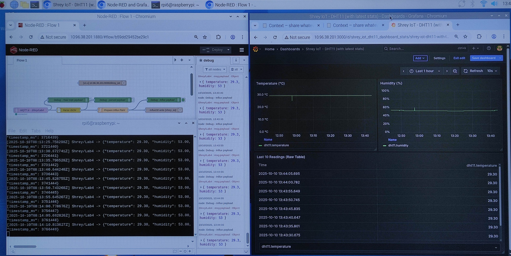
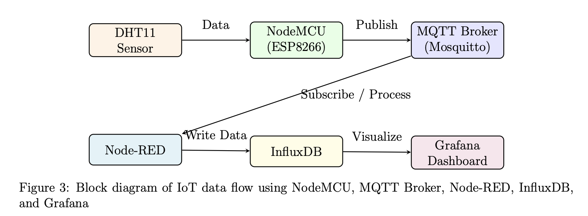
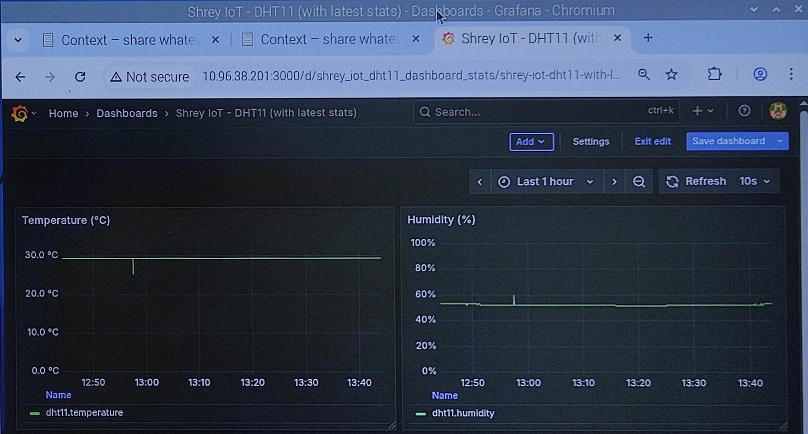

# 🌐 IoT-DHT11-MQTT-NodeRED-InfluxDB-Grafana

  

### 📋 Description
End-to-end IoT data pipeline using NodeMCU (ESP8266) and DHT11 to measure temperature and humidity.  
Data is published via MQTT to a Raspberry Pi running Mosquitto, processed with Node-RED, stored in InfluxDB,  
and visualized in Grafana dashboards for real-time monitoring and analysis.

---

### 🎯 Objective
- Implement an IoT system where a NodeMCU (ESP8266) equipped with a DHT11 sensor publishes temperature and humidity data to a Mosquitto MQTT broker running on a Raspberry Pi.  
- Process and subscribe to MQTT data using Node-RED.  
- Store processed data in InfluxDB.  
- Visualize real-time temperature and humidity data using Grafana dashboards.

---

### 🧩 System Overview
#### 📊 Data Flow:

  

---

### ⚙️ Components Used
    
| Component | Function |
|------------|-----------|
| **NodeMCU (ESP8266)** | Publishes DHT11 readings to MQTT |
| **DHT11 Sensor** | Measures temperature and humidity |
| **Raspberry Pi** | Runs Mosquitto, Node-RED, InfluxDB, Grafana |
| **Breadboard + Jumper Wires** | For sensor wiring |
| **Power/USB Cable** | To power devices |
| **Wi-Fi Network** | Communication between NodeMCU and Raspberry Pi |
| **Software** | Arduino IDE, Mosquitto, Node-RED, InfluxDB, Grafana, Python (paho-mqtt) |

---

## 🧠 Implementation Steps

### **Step 1 — NodeMCU publishes DHT11 data via MQTT**
Reads temperature and humidity from DHT11 and publishes JSON payloads every 5 seconds.
Flash DHT11_PUB-MQTT.ino into NodeMCU.

 
    

### **Step 2 - Install the required dependencies and libraries in the Raspberry Pi**

### **Step 3 - Processing data at the Broker**
Run RPi_SUB-MQTT.py in the Raspberry Pi. This would subscribe to the data published by the NodeMCU.

 
    

### **Step 4 - Building the Visualisation**
Build your dashboard in Grafana. The data would be stored in InfluxDB which would be routed via NodeRed.

 
    

